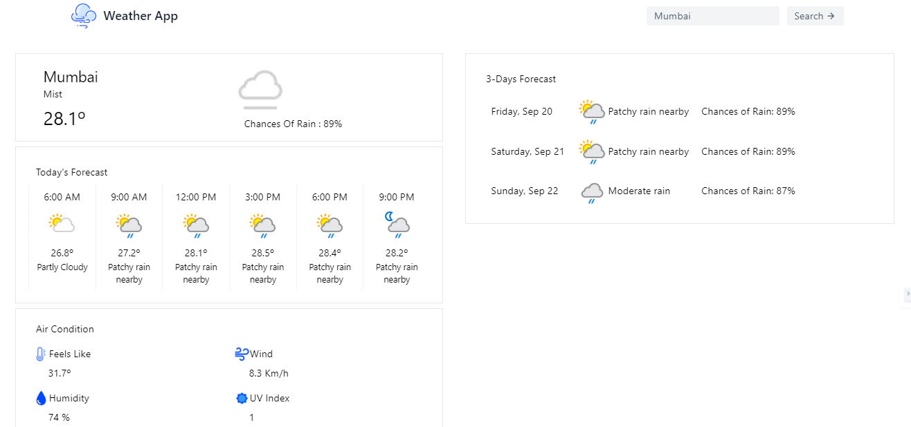

# Weather App with React and Tailwind CSS

Welcome to my Weather App project, built entirely from scratch using React and styled with Tailwind CSS. This project is a simple weather application that allows users to check the weather forecast for different locations.

## Features

- Check current weather conditions for a states and country Only.
- View a 3-day weather forecast.
- Get details on temperature, humidity, and more.
- Easily switch between cities to check the weather.

## Demo

You can see the app in action here: [Weather App Demo]([(https://weather72.netlify.app/)])

## Usage

To run this project locally, follow these steps:

1. Clone the repository:
   ```bash
   git clone (https://github.com/sayedhasan7/React-Weather-App-Basic.git)https://github.com/sayedhasan7/React-Weather-App-Basic.git


## App Preview

